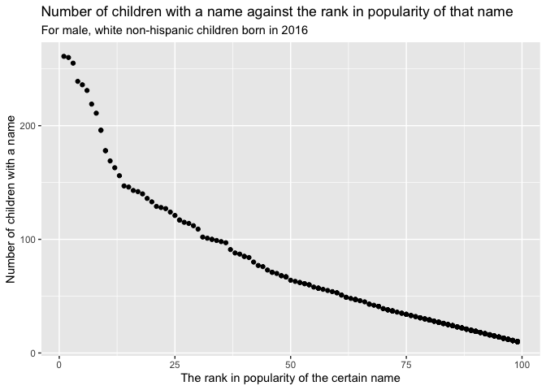

p8105\_hw2\_kx2173
================
ke
10/8/2021

## Problem 1

Read and clean the Mr. Trash Wheel sheet.

``` r
trash_wheel = read_excel("data/Trash-Wheel-Collection-Totals-7-2020-2.xlsx", 
                         sheet = "Mr. Trash Wheel", 
                         range = "A2:N535")%>%
  janitor::clean_names()%>%
  drop_na(dumpster)%>%
  mutate(sports_balls = round(sports_balls))
```

Read and clean precipitation data for 2018 and 2019.

``` r
precipitation_2018 = read_excel("data/Trash-Wheel-Collection-Totals-7-2020-2.xlsx", 
                         sheet = "2018 Precipitation", 
                         range = "A2:B14")%>%
  janitor::clean_names()%>%
  drop_na(month, total)%>%
  mutate(year = "2018")%>%
  relocate(year)


precipitation_2019 = read_excel("data/Trash-Wheel-Collection-Totals-7-2020-2.xlsx", 
                         sheet = "2019 Precipitation", 
                         range = "A2:B14")%>%
  janitor::clean_names()%>%
  drop_na(month, total)%>%
  mutate(year = "2019")%>%
  relocate(year)

combined_precipitation = 
  bind_rows(precipitation_2018, precipitation_2019)%>%
  mutate(
    month = as.integer(month),
    month = month.name[month])
```

Write a paragraph about data:

In Trash Wheel data, it has key variables: dumpster, month, year, date,
weight\_tons, volume\_cubic\_yards, plastic\_bottles, polystyrene,
cigarette\_butts, glass\_bottles, grocery\_bags, chip\_bags,
sports\_balls, homes\_powered, with number of 14 and has 454
observations. In precipitation data for 2018 and 2019, it has variables:
year, month, total, and total number of observation is 24. The total
precipitation in 2018 is 70.33. The median number of sports balls in a
dumpster in 2019 is 9.

## Problem 2

First, read and clean data in pols\_month.

``` r
pols_month = read_csv("./fivethirtyeight_datasets/pols-month.csv")%>%
  janitor::clean_names()%>%
  separate(mon, c("year", "month", "day"))%>%
  mutate(
    year = as.integer(year),
    month = as.integer(month),
    month = month.name[month],
    president = ifelse(prez_dem == "1", "dem", "gop")
    )%>%
  select(- day, -prez_dem, -prez_gop)%>%
relocate(year, month, president)
```

Second, clean the data snp.csv as well, arrange according to year and
month, and organize columns.

``` r
snp = read_csv("./fivethirtyeight_datasets/snp.csv")%>%
  janitor::clean_names()%>%
  mutate(date = lubridate::mdy(date))%>%
  separate(date, c("year", "month", "day"))%>%
  mutate(
   month = as.integer(month),
   month = month.name[month],
   year = as.integer(year),
   year = ifelse(year>2021, year - 100, year)
  )%>%
  select(-day)%>%
  arrange(year, month)%>%
  relocate(year,month)
```

Third, read and tidy the unemployment data.

``` r
unemployment_data = read_csv("./fivethirtyeight_datasets/unemployment.csv")%>%
  janitor::clean_names()
colnames(unemployment_data) = c("year","January","February","March","April","May","June","July","August","September","October","November","December")

unemployment_tidy = 
  unemployment_data %>%
  pivot_longer(
    January:December,
    names_to = "month",
    values_to = "unemployment_percentage"
  )%>%
  drop_na()%>%
  relocate(year, month)
```

Now, join the datasets.

``` r
pols_snp = left_join(pols_month, snp, by = c("year", "month"))

pols_snp_unemp = left_join(pols_snp, unemployment_tidy, by = c("year", "month"))
```

A short paragraph about these data sets. In our pols\_month data set, it
has 9 variables with the name of year, month, president, gov\_gop,
sen\_gop, rep\_gop, gov\_dem, sen\_dem, rep\_dem, and has 822
observations. It shows the number of national politicians who are
democratic or republican at any given time. The time period is from 1947
to 2015.

In snp data set, it has 3 variables including year, month, close, and
has 787 observations. It shows Standard & Poor’s stock market index
(S&P). The time period is from 1950 to 2015.

In unemployment data set, it has 3 variables with the name of year,
month, unemployment\_percentage, and it has 810 observations. Time range
is between 1948 to 2015.

In the first combined data set, it combined pols\_month data and snp
data, with dimension 822 and 10. Variables include year, month,
president, gov\_gop, sen\_gop, rep\_gop, gov\_dem, sen\_dem, rep\_dem,
close. Time period is from 1947 to 2015.

Another data set contains pols\_month data, snp data and unemployment
data all together, with 822 observations and 11 variables. Variables
include year, month, president, gov\_gop, sen\_gop, rep\_gop, gov\_dem,
sen\_dem, rep\_dem, close, unemployment\_percentage. Time period is from
1947 to 2015.

## Problem 3

load and tidy data.

``` r
baby_name = read_csv("./baby_names/Popular_Baby_Names.csv")%>%
  janitor::clean_names()%>%
  mutate(
    childs_first_name = tolower(childs_first_name),
    gender = toupper(gender),
    ethnicity = toupper(ethnicity)
    )

unique(pull(baby_name, ethnicity)) # Here we find something needs to be uniform
```

    ## [1] "ASIAN AND PACIFIC ISLANDER" "BLACK NON HISPANIC"        
    ## [3] "HISPANIC"                   "WHITE NON HISPANIC"        
    ## [5] "ASIAN AND PACI"             "BLACK NON HISP"            
    ## [7] "WHITE NON HISP"

``` r
baby_tidy = baby_name%>%
  mutate(
    ethnicity = recode(ethnicity, 
                       `ASIAN AND PACI` = "ASIAN AND PACIFIC ISLANDER",
                       `BLACK NON HISP` = "BLACK NON HISPANIC",
                       `WHITE NON HISP` = "WHITE NON HISPANIC"))%>%
  distinct()
```

Produce a table showing rank in popularity of the name “Olivia” as a
female baby name.

``` r
olivia_rank = baby_tidy%>%
  filter(gender == "FEMALE", childs_first_name == "olivia")%>%
  pivot_wider(
    names_from = "year_of_birth",
    values_from = "rank"
  )%>%
  select(-gender)%>% # Gender has been mentioned in table's caption.
  relocate("childs_first_name")

knitr::kable(olivia_rank, caption = "Rank in popularity of the name Olivia as a female baby name")
```

| childs\_first\_name | ethnicity                  | count | 2016 | 2015 | 2014 | 2013 | 2012 | 2011 |
|:--------------------|:---------------------------|------:|-----:|-----:|-----:|-----:|-----:|-----:|
| olivia              | ASIAN AND PACIFIC ISLANDER |   172 |    1 |   NA |   NA |   NA |   NA |   NA |
| olivia              | BLACK NON HISPANIC         |    49 |    8 |   NA |   NA |   NA |   NA |   NA |
| olivia              | HISPANIC                   |   108 |   13 |   NA |   NA |   NA |   NA |   NA |
| olivia              | WHITE NON HISPANIC         |   230 |    1 |   NA |   NA |   NA |   NA |   NA |
| olivia              | ASIAN AND PACIFIC ISLANDER |   188 |   NA |    1 |   NA |   NA |   NA |   NA |
| olivia              | BLACK NON HISPANIC         |    82 |   NA |    4 |   NA |   NA |   NA |   NA |
| olivia              | HISPANIC                   |    94 |   NA |   16 |   NA |   NA |   NA |   NA |
| olivia              | WHITE NON HISPANIC         |   225 |   NA |    1 |   NA |   NA |   NA |   NA |
| olivia              | ASIAN AND PACIFIC ISLANDER |   141 |   NA |   NA |    1 |   NA |   NA |   NA |
| olivia              | BLACK NON HISPANIC         |    52 |   NA |   NA |    8 |   NA |   NA |   10 |
| olivia              | HISPANIC                   |    96 |   NA |   NA |   16 |   NA |   NA |   NA |
| olivia              | WHITE NON HISPANIC         |   248 |   NA |   NA |    1 |   NA |   NA |   NA |
| olivia              | ASIAN AND PACIFIC ISLANDER |   109 |   NA |   NA |   NA |    3 |   NA |   NA |
| olivia              | BLACK NON HISPANIC         |    64 |   NA |   NA |   NA |    6 |   NA |   NA |
| olivia              | HISPANIC                   |    87 |   NA |   NA |   NA |   22 |   NA |   NA |
| olivia              | WHITE NON HISPANIC         |   233 |   NA |   NA |   NA |    1 |   NA |   NA |
| olivia              | ASIAN AND PACIFIC ISLANDER |   132 |   NA |   NA |   NA |   NA |    3 |   NA |
| olivia              | BLACK NON HISPANIC         |    58 |   NA |   NA |   NA |   NA |    8 |   NA |
| olivia              | HISPANIC                   |    77 |   NA |   NA |   NA |   NA |   22 |   NA |
| olivia              | WHITE NON HISPANIC         |   198 |   NA |   NA |   NA |   NA |    4 |   NA |
| olivia              | ASIAN AND PACIFIC ISLANDER |    89 |   NA |   NA |   NA |   NA |   NA |    4 |
| olivia              | HISPANIC                   |    86 |   NA |   NA |   NA |   NA |   NA |   18 |
| olivia              | WHITE NON HISPANIC         |   213 |   NA |   NA |   NA |   NA |   NA |    2 |

Rank in popularity of the name Olivia as a female baby name

Produce a similar table showing the most popular name among male
children

``` r
popular_male_name = baby_tidy%>%
  filter(gender == "MALE", rank == "1")%>%
  pivot_wider(
    names_from = "year_of_birth",
    values_from = "childs_first_name"
  )%>%
  select(
    -gender,
    -rank
  ) # Gender and rank have been mentioned in table's caption.

knitr::kable(popular_male_name, caption = "The most popular name among male children over time")
```

| ethnicity                  | count | 2016   | 2015   | 2014   | 2013   | 2012   | 2011    |
|:---------------------------|------:|:-------|:-------|:-------|:-------|:-------|:--------|
| ASIAN AND PACIFIC ISLANDER |   193 | ethan  | NA     | NA     | NA     | NA     | NA      |
| BLACK NON HISPANIC         |   148 | noah   | NA     | NA     | NA     | NA     | NA      |
| HISPANIC                   |   387 | liam   | NA     | NA     | NA     | NA     | NA      |
| WHITE NON HISPANIC         |   261 | joseph | NA     | NA     | NA     | NA     | NA      |
| ASIAN AND PACIFIC ISLANDER |   190 | NA     | jayden | NA     | NA     | NA     | NA      |
| BLACK NON HISPANIC         |   163 | NA     | noah   | NA     | NA     | NA     | NA      |
| HISPANIC                   |   356 | NA     | liam   | NA     | NA     | NA     | NA      |
| WHITE NON HISPANIC         |   299 | NA     | david  | NA     | NA     | NA     | NA      |
| ASIAN AND PACIFIC ISLANDER |   187 | NA     | NA     | jayden | NA     | NA     | NA      |
| BLACK NON HISPANIC         |   138 | NA     | NA     | ethan  | NA     | NA     | NA      |
| HISPANIC                   |   312 | NA     | NA     | liam   | NA     | NA     | NA      |
| WHITE NON HISPANIC         |   300 | NA     | NA     | joseph | NA     | joseph | NA      |
| ASIAN AND PACIFIC ISLANDER |   220 | NA     | NA     | NA     | jayden | NA     | NA      |
| BLACK NON HISPANIC         |   146 | NA     | NA     | NA     | ethan  | NA     | NA      |
| HISPANIC                   |   352 | NA     | NA     | NA     | jayden | NA     | NA      |
| WHITE NON HISPANIC         |   304 | NA     | NA     | NA     | david  | NA     | NA      |
| ASIAN AND PACIFIC ISLANDER |   197 | NA     | NA     | NA     | NA     | ryan   | NA      |
| BLACK NON HISPANIC         |   171 | NA     | NA     | NA     | NA     | jayden | NA      |
| HISPANIC                   |   364 | NA     | NA     | NA     | NA     | jayden | NA      |
| ASIAN AND PACIFIC ISLANDER |   177 | NA     | NA     | NA     | NA     | NA     | ethan   |
| BLACK NON HISPANIC         |   184 | NA     | NA     | NA     | NA     | NA     | jayden  |
| HISPANIC                   |   426 | NA     | NA     | NA     | NA     | NA     | jayden  |
| WHITE NON HISPANIC         |   292 | NA     | NA     | NA     | NA     | NA     | michael |

The most popular name among male children over time

Finally, produced a scatter plot showing the number of children with a
name against the rank in popularity of that name.

``` r
white_male_name = baby_tidy%>%
  filter(gender == "MALE",
         ethnicity == "WHITE NON HISPANIC",
         year_of_birth == "2016")

plot_final = 
  ggplot(white_male_name, aes(x = rank, y = count)) + geom_point() + 
  labs(title = "Number of children with a name against the rank in popularity of that name",
       subtitle = "For male, white non-hispanic children born in 2016",
       x = "The rank in popularity of the certain name",
       y = "Number of children with a name"
       )

plot_final
```

<!-- -->
